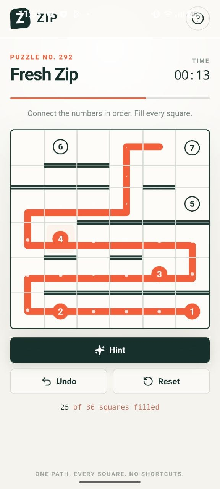
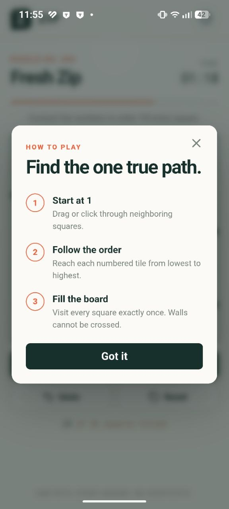
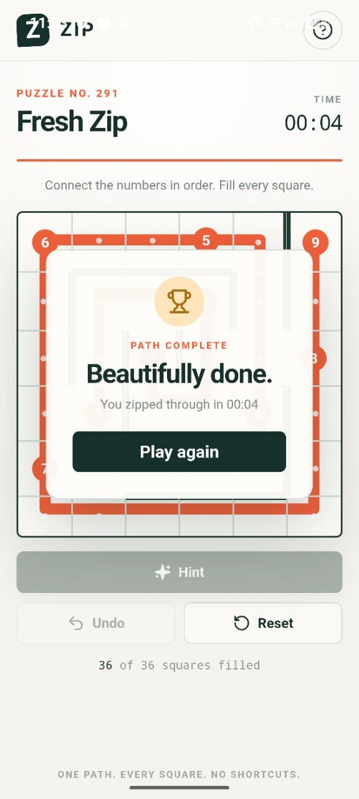

# Zip Path Puzzle

<p align="center">
  <strong>One path. Every square. No shortcuts.</strong>
</p>

<p align="center">
  A clean, tactile number-path puzzle for the web and Android.<br>
  Connect every number in order, fill the entire board, and find the one true path.
</p>

<p align="center">
  
</p>

<p align="center">
  
  
  
  
</p>

## The puzzle

Start at **1**, move through neighboring squares, and reach every numbered tile in ascending order. A solved path must visit every square exactly once without crossing a wall.

- **Fresh puzzles** generated directly on the device
- **Touch-first controls** with smooth drag-to-connect gameplay
- **Hints, undo, and reset** when you need another angle
- **Automatic progress saving** for the current puzzle, path, and timer
- **Fully offline play** with no account, backend, or internet connection required
- **Web and Android support** from one React codebase

## See it in action

<table>
  <tr>
    <td align="center" width="33%">
      <br>
      <strong>Learn in seconds</strong><br>
      <sub>Three simple rules are all you need.</sub>
    </td>
    <td align="center" width="33%">
      <br>
      <strong>Find the route</strong><br>
      <sub>Drag, rethink, undo, and keep moving.</sub>
    </td>
    <td align="center" width="33%">
      <br>
      <strong>Complete the path</strong><br>
      <sub>Fill every square and beat your time.</sub>
    </td>
  </tr>
</table>

## How to play

1. Start on the tile marked **1**.
2. Drag or click through horizontally or vertically neighboring squares.
3. Reach each numbered tile from lowest to highest.
4. Fill every square exactly once. Walls cannot be crossed.

On touch devices, press the last point in the orange route and slide across the board. You can also tap one neighboring square at a time. Slide back to the previous square to remove the latest segment.

## Run locally

### Web

Requires [Node.js](https://nodejs.org/) 20 or newer. Node.js 22 LTS is recommended.

```bash
npm install
npm run dev
```

Create and preview a production build:

```bash
npm run build
npm run preview
```

### Android

Install these prerequisites:

- Android Studio with the Android SDK
- JDK 17
- Node.js 20 or newer and npm

In Android Studio's SDK Manager, install the current Android SDK Platform, Android SDK Build-Tools, and Android SDK Platform-Tools. Set `JAVA_HOME` and `ANDROID_HOME` if Android Studio did not configure them for your shell.

Prepare or refresh the native Android project:

```bash
npm install
npm run android:sync
```

Build a debug APK:

```bash
npm run android:apk
```

The APK is written to `android/app/build/outputs/apk/debug/app-debug.apk`.

To run on an emulator or connected device, or to create a signed release, open the project in Android Studio:

```bash
npm run android:open
```

For a release APK or Android App Bundle, use **Build > Generate Signed Bundle / APK** in Android Studio and keep the signing key outside this repository.

## Offline by design

The Android app embeds the production web build, so gameplay never depends on a server. The current puzzle, route, timer, and progress are stored automatically in browser or Android WebView local storage under `zip-game-v2`. Clearing site or app storage resets the saved game.

---

<p align="center">
  Built for quick breaks, quiet focus, and the satisfaction of a perfectly zipped board.
</p>
